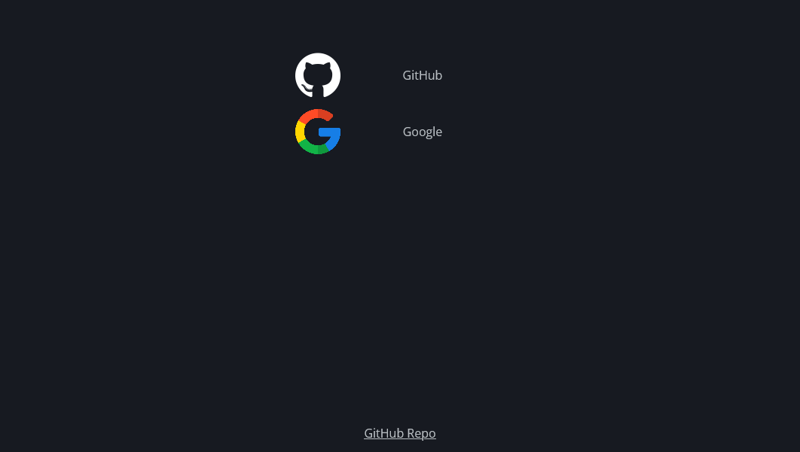

# Dashboard
A simple dashboard application designed to be easily configurable.\
Designed to be hosted through docker.



## Docker
I recommend deploying this application with the use of docker compose for ease.\
An example of deployment (with [traefik](https://traefik.io/traefik/) reverse proxy) can be seen below:
```yml
version: '3.9'
services:
  dashboard:
    image: randomman552/dashboard:latest
    user: 1000:1000
    container_name: dashboard
    volumes:
      - /storage/dashboard:/data
    labels:
      - "traefik.enable=true"
      - "traefik.http.services.dashboard.loadbalancer.server.port=80"
      - "traefik.http.routers.dashboard.rule=Host(`dashboard.local`)"
      - "traefik.http.routers.dashboard.entrypoints=web,websecure"
      - "traefik.http.routers.dashboard.tls=true"
```

This allows for the mounting of custom styles and config files in the host file system at `/storage/dashboard`

## Environment variables
- `DASHBOARD_PORT` - The port used by gunicorn to present the application.
  - Defaults to 80
- `DASHBOARD_DATA_PATH` - The path where data is located. Allows for customisation of the dashboard.
  - Defaults to `/data`

## Customisation
Customisation of the dashboard program are done through its data path.\
Any files placed within this directory will override the default ones.\
For example, a config.json file here will override the default one contained within the static folder.

This allows for the insertion of custom styles.css, config.json, and any icons or the site favicon itself.

### Config file
Config files are in the JSON format.\
A example set of fields is shown below:
```json
{
    "title": "Dashboard",
    "footer": "<a href='https://github.com/randomman552/Dashboard'>GitHub Repo</a>",
    "favicon": "/static/favicon.svg",
    "children": [
        {
            "children": [
                {
                    "name": "GitHub",
                    "link": "https://github.com/randomman552",
                    "icon": "/static/github.png"
                },
                {
                    "name": "Google",
                    "link": "https://google.co.uk",
                    "icon": "https://cdn-icons-png.flaticon.com/512/300/300221.png"
                }
            ]
        }
    ]
}
```

#### Description of fields:
- `title` - The title of the resulting page
- `footer` - HTML contained in the page footer
- `header` - HTML contained in the page header
- `children` - A list of category objects, each with its own name and children
  - `name` - The name of each category
  - `children` - A list of item objects, each with its own attributes
    - `name` - The name of the link, this is displayed next to the icon
    - `link` - A link to the service
    - `icon` - A url refering to the icon displayed next to this item
      - The icon variable can be a url to any image
      - Images can be locally hosted by placing them into the data directory of this program, where they can then be accessed via the `/static` endpoint

The output rendered by this example is the preview image of this repo.